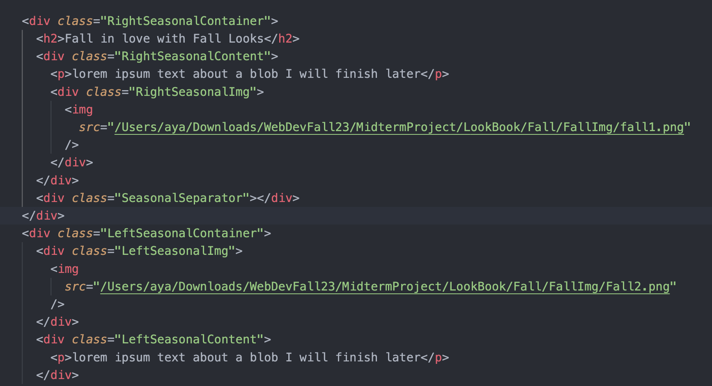

# My LookBook Website 
Concept: I plan on creating a website that inspires people of new fashion trends, pieces, and ideas. It's similar to a lookbook where different outfits are put together based off everyday wear, designer shows, and fun looks to replicate. Most of the outfits come from pinterest or seasonal fashion shows. It'll provide looks that are categorized by season giving endless efforts to be of daily use. 

## New Updates:
I was able to implement javascript through the toggle and onclick functions in javascript, it's a simple button that allows users to easily navigate through the seasonal pages of my website. 

## Progress
I was able to implement the structure of the website and some of the looks I wanted to feature. I reall enjoyed creating the scrapbook piece thats shown on the landing page and designing the grid of seasons. Knowing that display:flex was an option helped me with a lot of the formatting and allignment between two different div classes under one parent. 

## snippet of code 
)

Demo Website 

## Next Steps 
I wanted to implement a look book so it'd be nice to have a page where users can look through looks like it was an actual book, we just began javascript and learned about toggling so hopefully that could be something I do. I also want to complete the rest of the looks and fill out the full information neccecary. I also do want to have pop up informations or perhaps more options other than just seasonal wear. 

