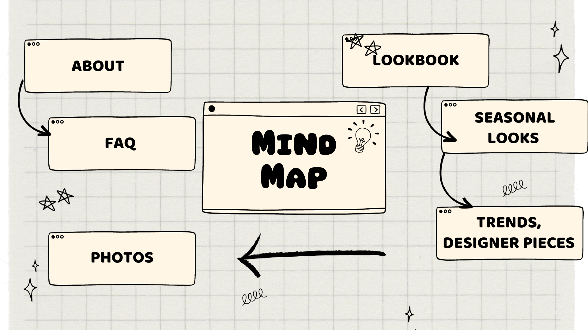

# HW - Due Monday, Week 5

Concept: I plan on creating a website that inspires people of new fashion trends, pieces, and ideas. It's similar to a lookbook where different outfits are put togehter based off everyday wear, designer shows, and fun looks to replicate. Most of the outfits come from pinterest or seasonal fashion shows. It'll provide looks that are categorized by season giving endless efforts to be of daily use. 

Mind Map 

[Wireframe]](https://www.figma.com/embed?embed_host=share&url=https%3A%2F%2Fwww.figma.com%2Ffile%2FVQfCfbSkj5cdvEnG56vJ5k%2FMidterm-Website%3Ftype%3Ddesign%26node-id%3D1669%253A162202%26mode%3Ddesign%26t%3DrTbG1maRLHZtgaef-1)

[Pinterest Board](https://www.pinterest.com/ayyaaxx/webfashionvisionboard/)

[Website Inspiration1](https://thommorison.com/)

[Website Inspiration2](https://www.incu.com/)

[Website Inspiration3](https://www.us.rains.com/)

[Website Inspiration4](https://www.loewe.com/usa/en/stories-collection/ss24-women-runway.html)

[Website Inspiration5](https://www.vogue.fr/fashion/galerie/fashion-trends-fall-winter-2022-2023)

Concepts: I have learned the signifance of positoning and repositioning to scale for different UX whether it's laptop, pc, iphone, ipad, etc. I always enjoyed learning differnt CSS styling techniques like display grid and flex to allign different html tags.

Concepts I still need to learn a dropdown menu for my nav bar, creating animations with css, and better equip myself with the color pallete that will fit the theme of the website. 

